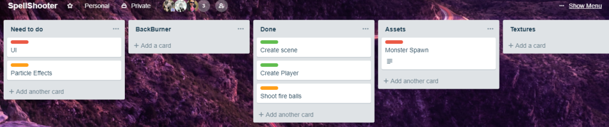

Using Unity, I made an FPS type of application which combines the use of physics, collisions, spawning, particle effects and movement.

Comments: 03/12/18

The end goal for this is to add more spells via the scroll wheel and to update the physics to it is as realistic as possible. Destructible objects and crates are also planned.

The planning stage at the moment is posted below. 

