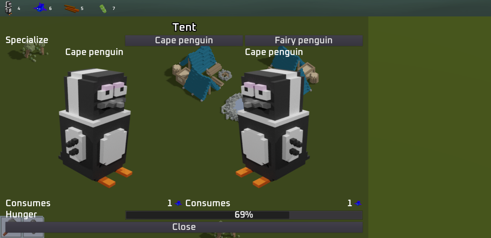

# Ludum Dare 48 - Penguin Paradise

## Introduction
“Well Well Well, if it isn’t the consequences of trying to go deeper and deeper into reality….”

Stranded after an experiment, you and your penguin friends need to gather resources to recover.

First on the surface of the planet, but sooner or later digging into the well seems very tempting.

## Link to play!
- [Play Jam version here](https://green-game-17.gitlab.io/penguin-paradise-ld48-freeze)
- [Play Post Jam here](https://gitlab.com/green-game-17/penguin-paradise)

## Engine:
Godot

## Concept:
2D Strategy Resource Management Game

## Art Style: 
Voxel 

## Reviews

#### <em>[by ditam (@ditam) - Ludum Dare User](https://ldjam.com/users/ditam/)</em>

	
<strong>"</strong>Holy Macaroni Penguins, what is this game!? There’s an incredible amount of content here for a jam game, 	congratulations! You start out with a couple of tents, then half an hour later you’re managing 100+ penguins and 13 different 	resources to build an ice-monument with robot penguins, crazy stuff…
	

	
I can’t add much to what was already said above: QOL updates would be great, but ultimately I too just gave up at the monument 	after I couldn’t make it complete a single percent, even though it was consuming resources… The game has turned into a bit too 	much of an idle/clicker game by that point, but the progression and awe I felt until that point was outstanding. Hats 	off!<strong>"</strong>

	

#### <em>[by Duck Reaction (@duck-reaction)- Ludum Dare User](https://ldjam.com/users/duck-reaction)</em>

	
<strong>"</strong>What HUUUGE work ! I’m so impressed by the result, it’s so difficult to make this kind of game during a jam 	muscle I think, there is all required features to make the game interesting.

	
Voxel design is cute (specialy peeguins). With more animations and Fx the game could be very juicy and become a commercialgame.
	There is an issue, sometimes, I can’t drop the building and it stuck on the mouse cursor. Great game !<strong>"</strong>
	

## Team
- @LucaVazz - Programming
- @toxs1ck - Art
- @MomoHunter - Programming
- @LauraMariee - Art
- [Losch](https://www.youtube.com/channel/UC8R6r7tm6vPO8pl5gFyLVHg) - Music

[Back to projects](projects.md)
