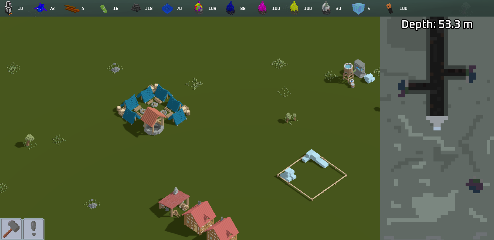
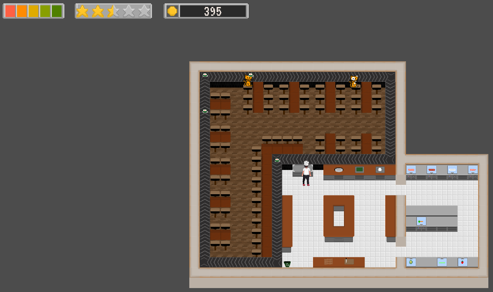

# Projects

## Virtual Online Shopping

This is a VR application which simulates clothes and how they fit 
on a customised model. 
[More Details](VOS.md)

## Ludum Dare 48 - Penguin Paradise

This is a strategy, resource management game. You have to guide the penguins in order to build the grand monument. 
[More Details](penguinParadise.md)

## AberCompSoc Game Jam - 2020 Simulator

This is a idle clicker game which was made for a game jam. You have to click the different objects to keep everything
balanced and beat the timer! 
[More Details](sim2020.md)

## Timeless Forest

This is a 2D platforming game. You have to run and climb to get through the level, avoiding the spikes and falling rocks! 
But don't worry if you make a mistake - you can travel back in time! 
[More Details](timeless_forest.md)

## Ludum Dare 47 - While(Sushi)

This is a game jam entry in which you are a chef who serves sushi to cats!
[More Details](whileSushi.md)

## Duck Game

This is a game where you have to destroy as much as possible using rubber ducks! 
[More Details](duckGame.md)

## The Floor is Lava

This is a platforming game where you have to avoid the floor! 
[More Details](lavaFloor.md)

