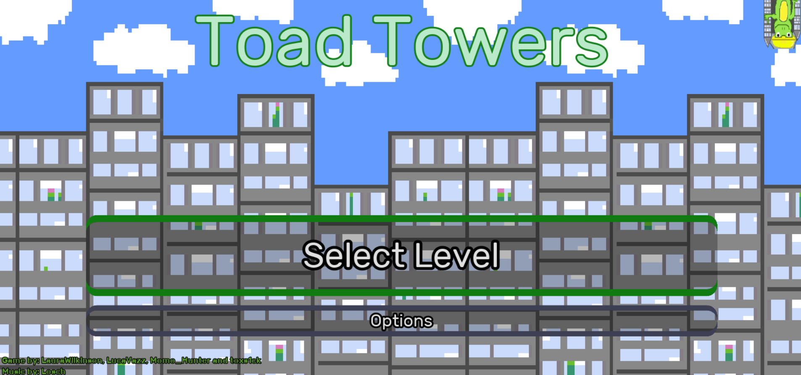
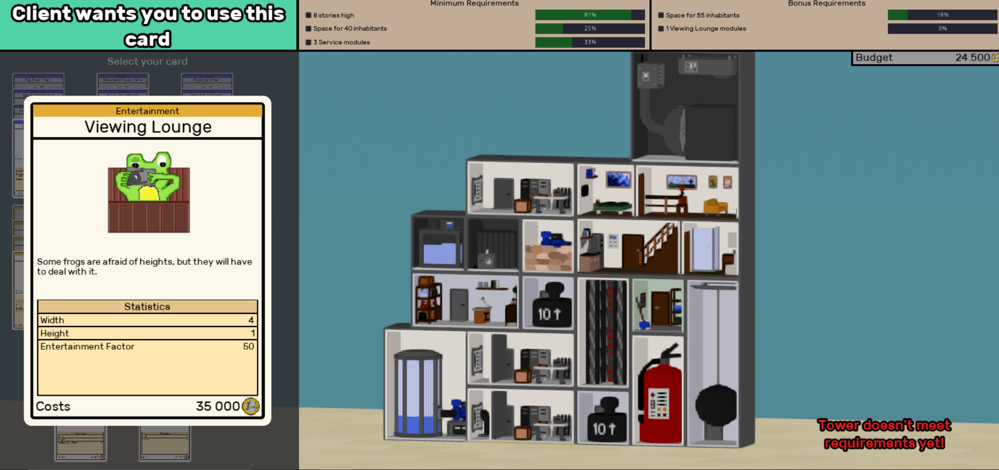

# Ludum Dare 49 - Toad Towers

## Introduction
You look at the new contract:

“Hey, we need you to build a very nice apartement complex, with enough space for many frogs to live there.
Also the area is very unstable, prone to earthquakes, tornados and such. So please take care of that as well. Should be an easy job, right?”

Are you bored with normal tower building games? Then prepare to be amazed at the construction skills of these frogs! 

Equipped with a toe tapping sound track and an intuitive card based UI, you’ll have an unfrogettable experience!

## Link to play!
[Play here](https://green-game-17.gitlab.io/toad-towers-ld49-freeze)

## Engine:
Godot

## Concept:
2.5D Tower Builder with a twist
## Art: 
Voxel 

## Current Status:
Completed 

## Documentation:

## Team
- @LucaVazz - Programming
- @toxs1ck - Art
- @MomoHunter - Programming
- @LauraMariee - Art
- [Losch](https://www.youtube.com/channel/UC8R6r7tm6vPO8pl5gFyLVHg) - Music

[Back to games](games.md)
