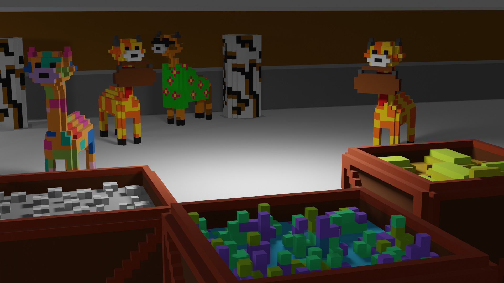
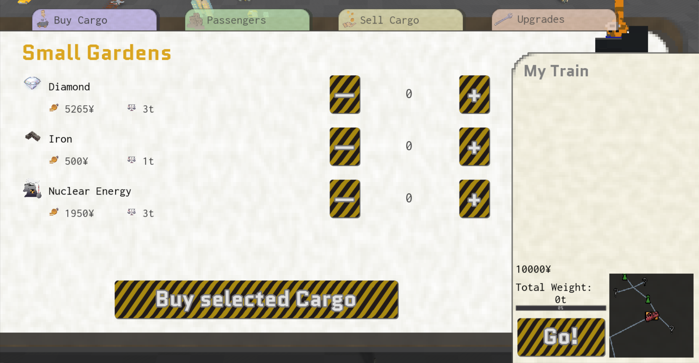

# On track to Party! 

## Introduction
Do you like trains? You can find them right here in this game!

Join Jeffrey the Giraffe in his high speed adventure to create the perfect party train! Travel accross 9 biomes and countless stations to get all the resources you need, whilst meeting new Giraffe passengers on the way!

Be warned! Every journey between stations only takes 10 seconds, not a lot of time to plan!

## Link to play!
[Download Link](https://green-game-17.gitlab.io/on-track-to-party/)

## Properties
Size:  
Platform: Browser

## Engine
Godot

## Concept
Manage your resources and passengers whilst going from station to station in 10 seconds! 

## Art Style
Voxel

## Current Status
Complete

## Team
- @LucaVazz - Programming
- @sknana0000 - Art
- @MomoHunter - Programming
- @LauraMariee - UX/Art
- @toxs1ck - Art
- [Losch](https://www.youtube.com/channel/UC8R6r7tm6vPO8pl5gFyLVHg) - Music 

[Back to projects](projects.md)
