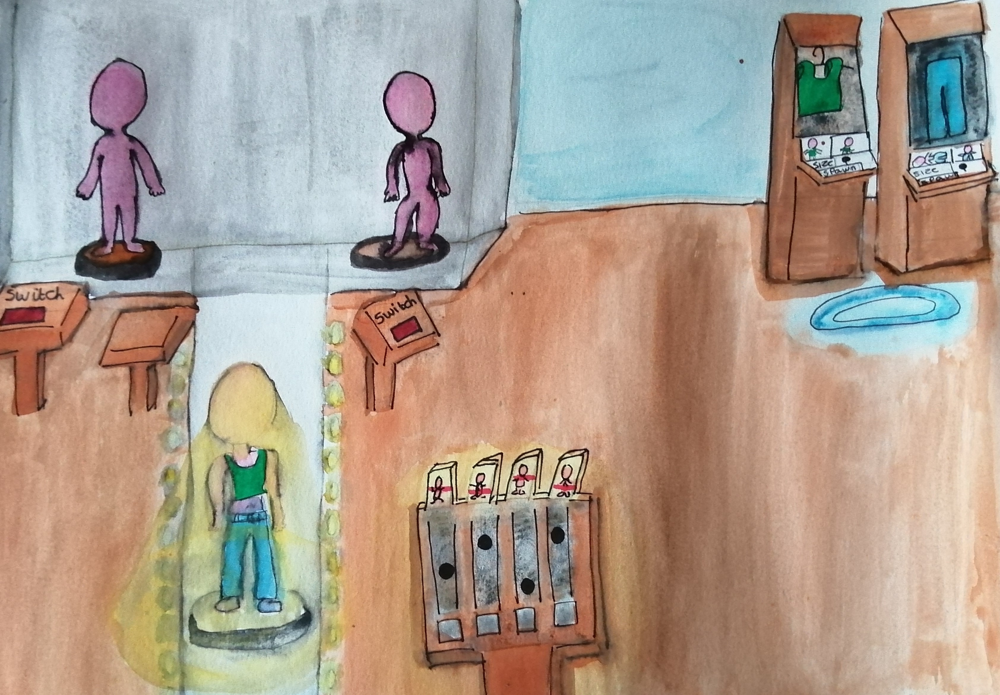

# Blog

[Development Outtakes](./outtakes)

## Week 1:
Environment:
A basic environment for VR was created along with teleportation, lighting, and Steam VR. There is also UI which changes the model from male to female. 

Models:
Got 2 models – male and female off the internet but it had the correct licensing. I put basic clothes on them and then made them into prefabs within Unity. The model prefabs have the appropriate components, so they spin on the spot. They are also rigged to make posing them easier. 

## Week 2:
Environment:
Started a few scripts to set up dynamic lever system. Still to be tested and only 
works with values - not models. 
Also added spin debug panel - basic prototype. 
Moved change model buttons to the platform. 

Models:
Created a platform and levers to control the model dimensions. 

Research:
Did research regarding body sizes and decided on using common sizes for presets.
Asos website size guide for reference. 
 
Decided on changing the traits:
- Neck
- Shoulder
- Leg Length
- Arm Length
- Waist 
- Hip

## Week 3:
Environment:
Created an upated lever podium with UI and working levers. Levers link with the model and should change the scale depending on the position.   

Models:
Re-rigged the female model to support posing and bone transformations. It needs polishing with certain areas but a prototype has been shown.
The male model needs to be rigged.  

Research:
Figured out appropriate scaling on the 3D model and examined measurement tables. 

Bugs:
Generated steam VR input, fixed usability issues and detected scaling issues.

Usability issues include:
- Teleporting
- Extra momentum on handles
- Scene scaling

## Week 4:
Enviroment:
Changed the table model, added UI for the levers. The levers are now polished - and all transformations are possible.  
Removed the buttons to change model as the design changed - added in Week 5. 

Models:
Re-rigged the female model in the bone transformations. 

Bugs:
Usability issues include:
- Fixed an issue in which the hand skeleton was reversed when moving the levers
- investigated and altered the offset of the model during rotation
- Scaled down the table and model

## Week 5:
Enviroment:
Data from the ASOS Api has been pulled into JSON files that are processed and assignable by clothing items. They are blocked out. 

Models:
Re-rigged male model to support bone transformations. 

Research:
Picked out 5 items from each category to model.

Bugs:
Usability issues include:
- Singular Teleport point added in front of the levers

## Week 6:
Enviroment:
Made some design changes with the code and environment to be more efficient - fixed performance issues.
Separated into new classes (Male and Female). 

Models:
Created clothing object with physics but manually entered. 

Bugs:
Usability issues include:
- Automatically detects bones of male and female bones in the model.

## Week 7:
Enviroment:
Made code more efficient and fixed some performance issues when in VR.
Button and script created to switch model and return to original position. 
Re added spin feature to updated models. 
Added initial spawn points for clothing on the two different kinds of model. 

Models:
Edited clothing object with physics and better scale but manually entered into the environment.
Fixed model scale to work within Unity. 

Bugs:
Usability issues include:
- Stopped inital crash when opening application in VR.
- Cleaned up unused assets.

## Week 8:
Enviroment:
Finalised general scene design and imported a new package to handle cloth physics.
New cloth physics package is based on bones which in turn help with dyamnic scaling. 

Models:
Refined tshirt clothing model and scaling.
Fixed mesh models for both models and clothes.

Bugs:
Usability issues include:
- Internalised the catagory JSON files and python script. 
- Fixed load in clothes error - new prefab created.

## Week 9:
Enviroment:
Created new environment with fixed lighting, clothes holder and 
filer system.  
Blocked out basic filter system.  

Models:
Created a clothes holder. 

Bugs:
Usability issues include:
- Only active model can be edited with levers.
- Abstract class created to refine model. 
[back to home](./index)
