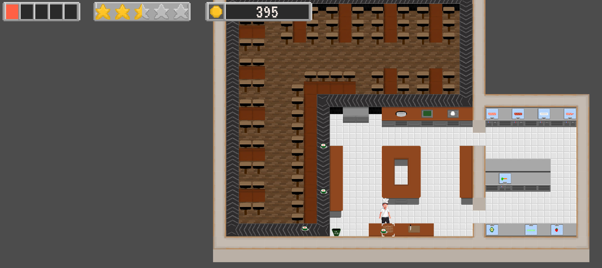

# Ludum Dare 47 - While(Sushi) 

## Introduction
“Bröther, I require the sushi!” 🍣

In an epic battle against bankruptcy, you must feed the guest room filled with hungry kittens to make them happy and earn as much money as possible;
while being stuck looping around your kitchen.

## Link to play!
[Play here](https://green-game-17.gitlab.io/while-sushi-ld47-freeze/)

## Engine:
Godot

## Concept:
2D Top-Down job simulation

## Art: 
Pixel Art

## Current Status:
Completed 

## Documentation:
Mechanics: Arrow keys to move, Space key to interact.

## Team
-@LucaVazz - Programming
-@toxs1ck - Audio/Art
-@MomoHunter - Programming
-@LauraMariee - Art
-[Losch](https://www.youtube.com/channel/UC8R6r7tm6vPO8pl5gFyLVHg) - Music

- [Back to games](games.md)
